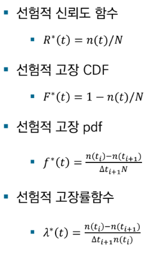
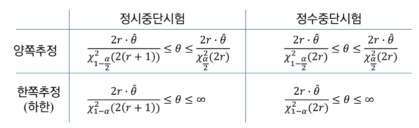

{.post-thumbnail}

## 품질과 신뢰성

- 신뢰성: 시간적 측면에서 제품을 오랫동안 고장 없이 사용할 수 있는 것을 의미
    - 관리도와의 차이점: 관리도는 특정 시점에서의 변동을 다룸(정적인 시간)
    - 정해진 사용 조건 하에서 요구되는 기능을 `주어진 기간`동안 수행하는 능력
- 신뢰도: 시스템, 기기, 부품 등이 시간성 안정성을 나타내는 정도 (신뢰성의 정도)
- 신뢰성과 품질경영: 과거 품질 관리는 공정중심의 관리와 사후 관리에 치중되었으나, 신뢰도 공학은 사전예방 시스템으로 고장 발생 확률을 미리 예방하기 위해, 사전 시스템 공학적 품질경영을 추구
    - 소비자가 사용하다가 고장이 나는 경우도 고려

## 신뢰도 공학의 특징

- 시스템 전 수명 주기에 걸친 체계적인 신뢰성 활동 요구
- 장기간 축적된 다양한 고유 기술들이 연관되어 있다.
- 신뢰성 데이터는 매우 고가
    - 10년 수명 보장 제품을 만들려면 원칙적으로 10년 동안 테스트 해야 한다.
    - 가속수명시험을 통계적으로 분석하여 10년 후를 예측. 하지만 과정이 복잡하고 비용이 크다.

## 신뢰성 척도

- f(t): 특정 시점 t에서 시스템이 고장 날 확률의 밀도. 지수분포, 와이블 분포, 정규분포 등
- 신뢰도 함수 R(t): 제품이 t 시점까지 고장이 나지 않을 확률
    - $R(t) = P(T > t) = ∫[∞, t] f(x) dx$
- 불신뢰도 함수 F(t): 제품이 t 시점 안에 고장이 날 확률
    - F(t) = P(T ≤ t) = 1 - R(t)
    - F′(t) = f(t)
- 고장률 함수 λ(t): 시점 t까지 생존한 제품이 아주 짧은 다음 시간 내에 고장 날 순간적인 비율
    - $λ(t) = \frac{f(t)}{R(t)} = \frac{f(t)}{1 - F(t)}$
    - $R(t) = e^{-∫[0, t] λ(x) dx}$
    - $f(t) = λ(t) e^{-∫[0, t] λ(x) dx}$

## 욕조 곡선

- 일반적으로 제조품의 고장률은 예방보전을 하지 않으면 욕조곡선을 그린다고 알려짐
- 수명 T가 Weibull 분포를 따른다고 가정

### 초기고장기간

- 사용 개시 후에 비교적 빠른 시간에 설계, 제조상의 결함 혹은 사용환경의 부적합으로 발생하는 고장
- 와이블 분포(α < 1)로 모델링
- 불량품들이 초기에 빠르게 걸러지면서 고장률이 급격히 감소

### 우발고장기간

- 안전계수($\frac{파괴강도(최대로 견딜 수 있는 힘)}{허용응력(실제하중)}$) 여유있게 설정하면 고장률이 낮고 비교적 일정한 기간으로 유지된다.
- 와이블 분포(α = 1)로 모델링

### 마모고장기간

- 피로, 마모, 노화현상 등으로 고장률이 높아지는 기간
    - 파국고장: 갑자기 기능을 잃어버림
    - 열화고장: 점진적으로 부분적으로 기능을 상실함
- 적절한 예방보전으로 수명을 연장할 수 있음
- 정규분포 혹은 와이블 분포(α > 1)로 모델링

## 경험적 신뢰성 척도

- 실제 분포를 모를 때, 관측치만으로 신뢰성 척도를 추정하는 비모수적 방법

- 평균 순위법의 분모가 n+1인 이유는 안전장치를 둬서 샘플이 다 고장나도 아직 수명이 다 끝나지 않았다는 것을 고려
- 두 방식이 큰 차이는 없다

## 지수분포

- $f(t) = λe^(-λt), t ≥ 0$
- $R(t) = e^(-λt)$
- $F(t) = 1 - e^(-λt)$
- $λ(t) = λ$ (t가 없다: 시간에 관계없이 고장률이 일정)
- 평균수명(MTTF): $E(t) = 1/λ$

## 정규분포

- 기계부품의 수명 분포에 활용
- $f(t) = \frac{1}{σ}Φ(\frac{t - μ}{σ})$
- $R(t) = 1 - Φ(\frac{t - μ}{σ})$
- 평균수명(MTTF): $E(t) ~ μ$(0부터 계산하니까 근사값. 하지만 거의 비슷함)

## 보전

- 고장나거나 결함이 있는 시스템을 수리를 통해 사용 가능한 상태로 유지하기 위한 조치 및 활동
- 사후 보전(BM): 고장날 때 까지 사용하고 고장나면 수리하는 것(고장보전, 대응보전)
- 예방 보전(PM): 고장을 예방하기 위해 고장 여부와 관계없이 주기적으로 점검, 수리, 교체하는 것(계획보전, 정기보전)
- 예측 보전(PdM): 실시간 데이터와 AI/통계 모델로 고장 징후를 미리 예측하고 고장이 임박했을 때 수리하는 방법

## 보전도

- M(t): 시스템이 고장났을 때, t 시간안에 수리가 끝날 확률을 의미
- Mean Time To Repair (MTTR): 평균 수리 시간
- MTTR이 1/μ일 때, 수리 시간이 지수분포를 따른다면
    - $M(t) = 1 - e^{-μt}$
    - 수리율: μ

## 가용도

- MTBF(Mean Time Between Failures): 평균 고장 간격 시간(MTTF + MTTR)
- 가용성 = MTTF / MTBF
- MTTR을 줄이는게 가용성 향상에 효율적

## 신뢰도 입증 시험

- 샘플이 목표 신뢰도 함수를 달성하는 지 검정
- 전수시험: 모든 대상의 수명을 관찰하는 시험
- 중단시험: 모두 수명을 다하기 전에 중단하는 시험
    - 정시중단시험: 정해진 시간까지만 시험하고 중단(Type 1 censoring)
    - 정수중단시험: 정해진 개수까지 고장나면 중단(Type 2 censoring)

### 지수 분포의 신뢰도 함수 추정

- 모수는 최우추정법으로 추정

- $R(t) = e^{-λt} -> \frac{1}{R(t)} = e^{λt} -> ln(\frac{1}{R(t)}) = λt$
- median 순위법으로 R(t) 추정. 최우추정법으로 λ 추정

### 최우추정치의 신뢰구간

- r = 고장난 샘플 수
- 개수가 fix가 아니여서 정시중단 시험에 1개를 넣넣하게 넣어줌
- r = 0일 때: 정수중단시험은 계산 불가, 정시중단시험의 평균 추정치는 ∞, 신뢰구간은 $-\frac{T}{lnα} ≤ θ ≤ ∞$
    - 수명이 지수분포를 따를 때, r은 포아송 분포를 따름
        - $P(r <= c) = ∑[0, c] e^{-m}m^r / r!$
    - 평균수명이 θ일 때, 총 시험시간(T) = $n t_0$ 고장수의 평균 m = T / θ
    - 무고장 확률 $α = P(r = 0) = e^{-T/θ}$ (보통 0.05)로 설정
