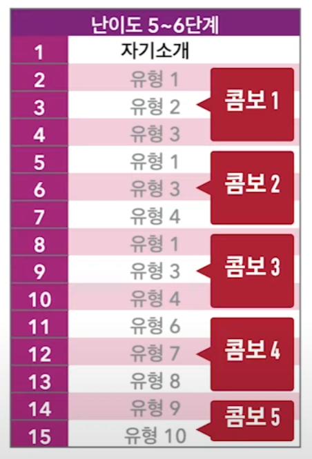

{.post-thumbnail}

## 시험 구조

- 시험 시간은 총 40분. 답변 시간은 자유
- 2분 정도 지나면 다음 문제로 넘어갈 수 있는 버튼이 활성화됨.
- 후반 문제는 조금 늦게 나옴

## 질문 유형

1. 자기소개
2. background survey
3. 돌발

1번 문제가 자기소개. 점수엔 딱히 영향 없고, 그냥 목소리 푸는 용도

2/3/4, 5/6/7, 8/9/10, 11/12/13, 14/15 는 background survey 및 돌발 질문

각각의 묶음은 combo 문제

### combo 별 10개 유형

1. 묘사
    - 일반적으로 이렇다는걸 대답. 현재형으로 대답
    - 가장 쉽고 배점이 낮기 때문에 적당히 대답
1. 루틴, 단계, 활동
    - 1번과 마찬가지로 현재형으로 대답
1. 처음 / 최근 경험
    - 육하원칙, 과거형
    - 최초 경험은 시간에 따른 취향 변화도 물어봄
1. 가장 인상적인 경험
    - 구체적인 설명 필요. 문제 경험을 물어보기도 함
    - 배점이 높으니까 신경써서 대답
1. 에바에게 질문하기
    - 안나옴
1. 주어진 상황에 3-4가지 정보 요청하기
1. 6번에서의 문제 상황 설명 및 대책 2-3가지 세우기
1. 이와 같은 본인 경험
    - 7번과 유사한 나의 경험
1. 비교 / 대조
    - 자세한 예를 들어 설명
    - 마무리는 선호
1. 주제 관련 이슈, 문제점, 걱정거리, 뉴스
    - 예시, 상황, 생각, 의견

## 답변 구조

1. main idea
    - 첫인상, 요지, hook
1. body
    1. -
    2. 강조 구간 (2-3 문장 속도감 있게)
    3. 강조 구간
1. conclusion
    - 역질문 what about you?
    - 제안하기 why dont we 동사, lets 동사
    - 급 마무리 thats it for this question
    - 1 + 3

## 공부 방법

주제별로 공부

묘사 -> 루틴 -> 비교 -> 과거 경험 -> 롤플레이 -> 어드밴스
