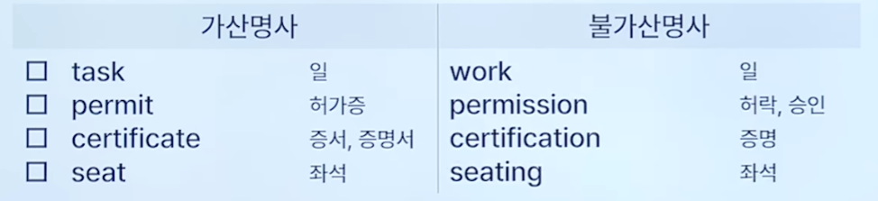
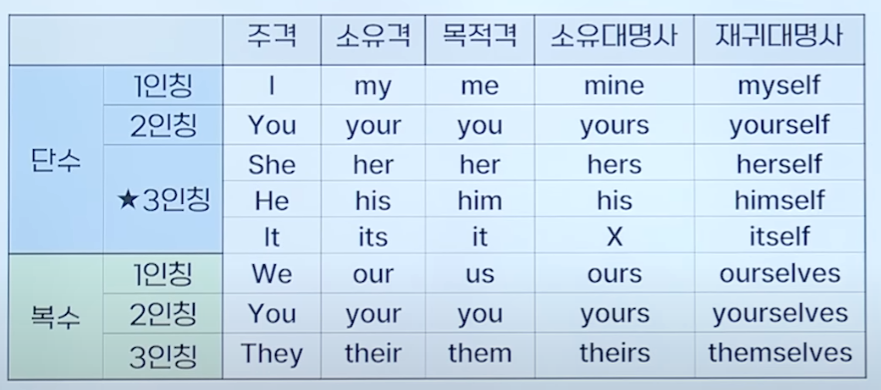
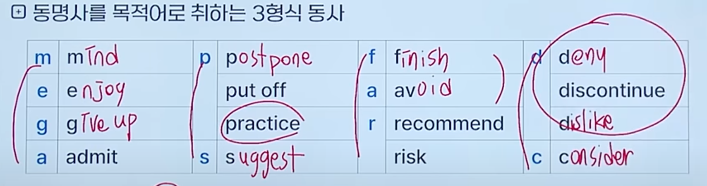
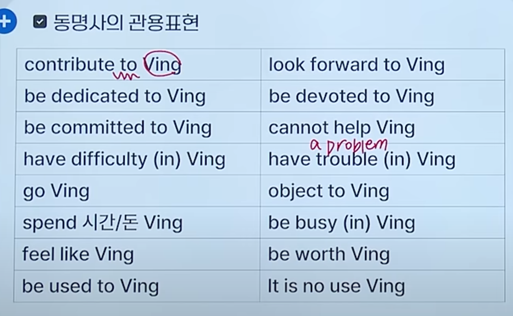

{.post-thumbnail}

## 명동형부

### 명사 / 대명사

- 기본 명사 생김새
    1. 명사 1초 공식 TOP 5
        1. 관사(a/an/the) + 명사 + 전치사
        2. 전치사 + 명사 + 전치사
        3. 관사/소유격 + (부사) + (형용사) + 명사
        4. 형용사(지시형용사, 수량형용사) + 명사
        5. 명사 + 명사
    2. 명사 자리
        1) 주어
        2) 타/목
        3) 전/목
        4) 보어
    3. 가산명사 vs. 불가산명사
        > 관사 a/an는 가산 단수 명사 앞에만 쓸 수 있다.
        > the는 가산 단수 복수, 불가산 명사 앞에 쓸 수 있다.
        - 불가산 명사: a/an, -s 안 붙음
            information: 정보
            advice: 조언
            merchandise: 상품
            access: 접근
            assistance: 지원
            equipment: 장비
            luggage/ baggage: 수하물
            stationery: 문구류
            funding: 자금 제공
            furniture: 가구
            produce: 농산물
            news: 소식
        
            - ~ing는 대부분 불가산 명사
    4. 사람명사 vs. 사물명사
        - 사람명사: 가산 명사
        - 사물명사: 가산/불가산 명사
    5. 특이 어미 명사: -al(proposal, arrival, approval), -ive(`initiative`), 

- 기본 인칭대명사 표
    1. 소유격-소유대명사
        - 소유격 뒤에만 명사가 올 수 있다.
        - his: 소유격이면서 소유대명사
        
    2. 목적격-재귀대명사
        - 재귀대명사는 재귀용법, 강조용법(부사 자리)으로 사용 가능
    3. 지시대명사
        1. This, That + 단수동사/ These, Those + 복수동사
        2. Those who + 복수동사
    4. 부정대명사
        - one vs another
        - some vs any
            - some: 긍정문(not이 없음), 권유나 제안을 나타내는 의문문
            - any: 부정문, 의문문, 조건문, 어떤 ~라도

### 동사 (수, 태, 시제)

- S질량의 보존의 법칙: 단수 주어 + 단수 동사 / 복수 주어 + 복수 동사
    - 고유명사(대문자)는 단수
    1. 주어 + 거품(부사 / 전치사구) + 동사
    2. 무조건 동사원형 자리
        - 조동사(will, can, should, may) + 동사원형
        - please + 동사원형
    3. 무조건 단수 동사
        - 단수 명사
        - 불가산 명사
        - to 부정사구
        - 동명사구
        - that 절

- 기본 동사 보는 방법
    - pp + be: 수동
    - 나머지: 능동

### 형용사 / 부사

1. 형용사 위치와 공식
    - 주격 보어자리(s + 2v + sc), 2v: be, become, remain, seem, Stay
    - 목적격 보어자리(s + 5v + o + oc), 5v: Keep, Find, Consider, Make
2. 수량형용사 수일치
    1. each, every, another + 단수 명사
    2. many, (a) few, a number of, several + 복수명사
        - a number of + 주어: 주어에 맞춘 동사
        - the number of + 주어: the number of에 맞춘 동사(단수)
    3. much, little, a little, less + 불가산 명사
        - a little(few) vs litte(few): a 가 붙으면 긍정, 아니면 부정
    4. all, some, most, a lot of + 복수 명사/ 불가산 명사

## 전접부

### 전치사 / 등위접속사 / 부사절 접속사

- 빈출 접속사
    - at: 시각(at 7 a.m., `at the end of this year`), 정확한 지점 / 주소
    - on: `몇 월 몇 일`, 일, 접촉(on the table, on the wall, on the ceiling)
    - in: 연도, 월, 계절, 행정 구역, 3차원 공간
    - until: (동사가) 지속성
    - by: (동사가) 일회성
    - during: 특정 기간 명사
    - for: 숫자, 숙어, ~을 위해
    - through: ~을 통해(관통해서), 수단 / 매개
    - throughout: 장소, 시간
    - between / among: 복수명사가 온다. between은 2개, among은 3개 이상
    - since: 부사로도 쓸 수 있긴 함
    - because of / due to / `owing to` / `on account of`: ~때문에
    - 
- 등위접속사
    - Both A and B
        - 복수 동사
    - Either A or B
    - Neither A nor B
    - Not only A but also B
    - B As well as A
    - Not A but B
        - B에 맞춘 동사
- 부사절 접속사
    - 조건: if, unless, `provided` (that), as long as, in case (that), in event (that)

### 명사절 접속사 / 형용사절 접속사

- if 미래내용: 현재동사
- 형용사절 접속사
    - 소유격 + 완전한 문장
    - 그 외 + 불완전한 문장
    - , 다음에 that 안 씀

### 접속부사 / 전치사 접속사 부사

- notwithstanding: ~에도 불구하고

## 준동사

### To부정사 / 동명사 / 분사

- To부정사: 명사, 형용사, 부사(~하기 위해서 `so as to`, in order to) 역할. 미래 지향적인 느낌
- 동명사: 명사 역할. 과거 지향적이고 부정적인 느낌

- 분사: 형용사 역할
    - 자동사: ing

## 기타

### 분사 구문 / 비교 구문

